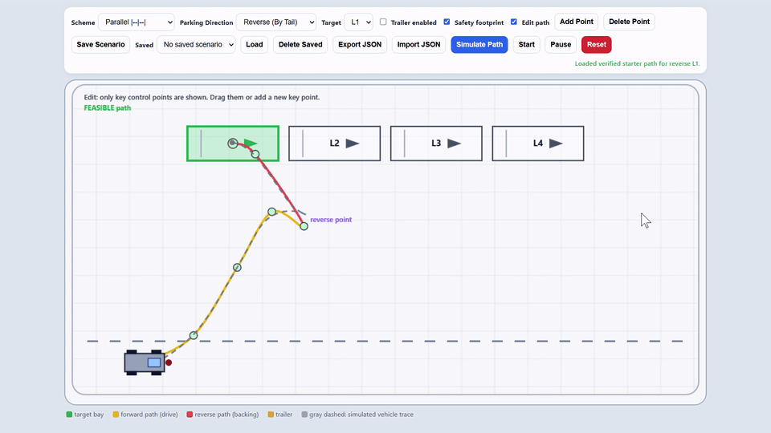

# Kinematic Parking Simulator

An interactive, browser-based **HTML5 parking simulator** for teaching, testing, and demonstrating vehicle path planning, parking maneuvers, trajectory editing, and basic autonomous-driving control concepts.

> **Developed by Dr. Vahid Tavakkoli for educational purposes.**

---

## Demo

The simulator supports editable control points, forward and reverse maneuvers, target-bay selection, and animated path tracking.



---

## Overview

This project demonstrates how a kinematic vehicle can:

- Enter parking bays using **forward** or **reverse** motion,
- Handle different parking lot geometries,
- Follow editable user-defined trajectories,
- Visualize the simulated path before and during execution,
- Evaluate collision, boundary, and feasibility constraints,
- Optionally include a **trailer** for advanced maneuvering behavior,
- Persist and exchange scenarios using browser storage or JSON files.

The simulator is implemented in a single `index.html` file using plain JavaScript, HTML, and CSS. It does not require a backend server, build pipeline, or external dependencies.

---

## Main Features

### Parking schemes

- Parallel parking
- Perpendicular parking
- Angled parking

### Direction modes

- **Reverse parking** by tail alignment
- **Forward parking** by head alignment

### Interactive path editing

- Toggle path edit mode
- Drag editable control points
- Add or delete control points
- Re-simulate quickly after path modification
- Preview the resulting simulated trajectory

### Simulation controls

- Select target parking bay
- Select parking direction and scheme
- Simulate path
- Start, pause, and reset animation
- Show the simulated trace during movement

### Safety and validation

- Collision-aware vehicle footprint checking
- Boundary checking against the parking area
- Feasibility status feedback
- Dashed gray preview path for simulated motion
- Reset of preview path after changing target, parking direction, or parking scheme

### Scenario persistence

- Save scenarios in browser storage
- Load and delete saved scenarios
- Export scenarios as JSON
- Import scenarios from JSON

### Trailer support

- Optional trailer rendering
- Trailer wheel visualization
- Useful for teaching forward and backward parking with articulated vehicle behavior

---

## Educational Value

This simulator is suitable for courses, labs, and demonstrations related to:

- Vehicle kinematics,
- Motion planning,
- Trajectory tracking,
- Parking-assistance systems,
- Collision detection,
- Path feasibility checking,
- Human-in-the-loop path design.

Because the simulator is contained in one readable HTML file, students can directly inspect, modify, and extend the algorithms.

---

## Quick Start

1. Clone or download this repository.
2. Open `index.html` in any modern browser.
3. Choose the parking scheme, parking direction, and target bay.
4. Click **Simulate Path** to generate/preview the trajectory.
5. Click **Start** to animate the vehicle.
6. Optionally enable **Edit path** and adjust the sparse control points.
7. Re-run the simulation after modifying the path.

No build tools or package installation are required.

---

## How to Use the Simulator

### 1. Select the parking configuration

Choose the parking layout, such as parallel, perpendicular, or angled parking. Then choose whether the vehicle should park forward or reverse.

### 2. Select the target bay

Click or select the desired target parking bay. When the target changes, the old gray preview path is cleared so the visible simulation always matches the active target.

### 3. Simulate the path

Click **Simulate Path** to check the candidate maneuver. If the path is valid, the simulator shows a gray preview trace and prepares the animation.

### 4. Edit the path

Enable path editing to move, add, or remove control points. This is useful when teaching why a path is feasible or infeasible.

### 5. Start the animation

Click **Start** to animate the car along the simulated trajectory. Use **Pause** and **Reset** to inspect intermediate behavior.

### 6. Save or export scenarios

Use the built-in save/export functions to keep reusable demonstrations or exchange path configurations with students.

---

## Project Structure

```text
.
├── index.html                    # Full simulator: UI, rendering, kinematics, path editing, and persistence
├── reverse_parking_simulator.gif  # README demo animation
├── LICENSE                       # MIT license
└── README.md                     # Project documentation
```

---

## Suggested Teaching Exercises

- Compare forward and reverse parking for the same target bay.
- Modify control points and observe how feasibility changes.
- Create a path that fails due to collision or boundary violation.
- Discuss why trailer parking is more difficult than rigid-body vehicle parking.
- Export a scenario, modify the JSON, and reload it.
- Ask students to improve the path-generation or collision-checking logic.

---

## Technical Notes

- The simulator uses a simplified kinematic model suitable for education and visualization.
- It is not intended to replace professional-grade vehicle dynamics or autonomous-driving software.
- Collision and feasibility checks are designed for interactive feedback and teaching.
- The project is intentionally dependency-free so it can run offline in a browser.

---

## Browser Compatibility

The simulator should work in modern versions of:

- Google Chrome
- Microsoft Edge
- Mozilla Firefox
- Safari

For the best experience, use a desktop browser with a sufficiently large screen.

---

## License

This project is licensed under the **MIT License**. See the [LICENSE](LICENSE) file for details.

---

## Acknowledgment

Created and maintained for educational use by **Dr. Vahid Tavakkoli**.
